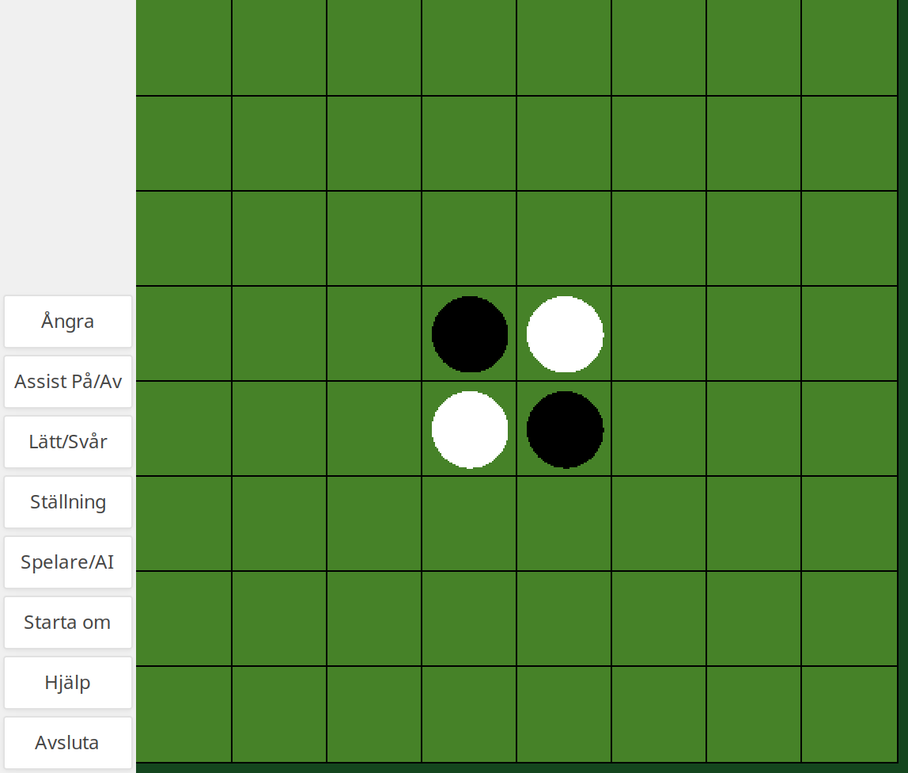

# Othello
An Othello clone written in (what was then) Lisp DrScheme as part of a uni project.
Turns out DrScheme is now DrRacket.




## Features
* State of the art AI
* AI difficulty levels
* Board highlight guides
* PvP mode

## Requirements
[Racket](https://download.racket-lang.org/).
Ensure it is installed with the `racket/gui` collection.

## Running the game
Unfortunately I've not been able to get the game running properly
while compiled as a standalone executable, so it requires Racket to run.

### On the command line
Run in this directory:
```
$ racket -i -e '(require "Allting.rkt")'
```

This starts the game in the Racket REPL, which appears to be
the only way to get the game running and detecting end-of-game
conditions successfully. Note that you'll have to type

```bash
> (exit)
```

or press `CTRL+D` in the REPL to exit.

### In DrRacket
Just press the green right arrow triangle (Run).

## Authors
* Johan Brandhorst
* Robin Carlsson


